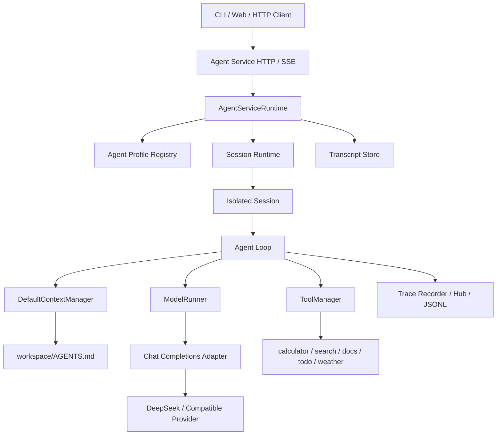

# Ailoha Agent Runtime

Ailoha 是一个基于 TypeScript 的最小 Agent Runtime。它提供完整的 Agent Loop、工具注册与调用、Session 隔离、Context 管理与压缩、OpenAI-compatible 模型适配、HTTP/SSE 服务以及执行 Trace。

项目依赖已发布的 `@earendil-works/pi-ai` 消息、模型和 Schema 类型，但 Agent Runtime 本身维护在本仓库中。

## 1. 当前能力

- ReAct 风格 Agent Loop：模型决策、工具执行、结果回填、继续推理或返回最终答案。
- 工具注册机制：每个工具包含名称、描述、参数 Schema 和执行函数。
- 内置工具：`calculator`、Mock `search`、`read_docs`、`todo`、Mock `weather`。
- OpenAI-compatible Chat Completions Adapter：支持流式文本、思考块和分片工具调用解析。
- 多 Session 管理：不同窗口可以并发运行，Context、工具状态、队列和 Trace 相互隔离。
- Context 压缩：支持自动压缩、上下文溢出恢复和手动压缩。
- Workspace Memory：从 Session workspace 根目录读取 `AGENTS.md`，作为 system-level 指令注入模型。
- Agent Service：提供 Profile、Session、Message、Run、Operation、Transcript、SSE 和 Trace API。
- 执行观测：记录 Run、LLM、Context、Tool 的结构化生命周期事件，并可持久化为 JSONL。

## 2. 仓库结构

```text
packages/
├─ agent-core/                 Agent、Session、Context、工具调度和 Trace 核心
├─ agent-service/              应用层 Runtime 与 Node HTTP/SSE 接口
├─ agent-tools/                calculator/search/read_docs/todo/weather
└─ chat-completions-adapter/   OpenAI-compatible 请求构造与流式响应解析

scripts/
├─ deepseek-http-server.mjs                    本地 DeepSeek Agent 服务
├─ deepseek-http-e2e.mjs                       真实模型 HTTP 黑盒 E2E
├─ deepseek-workspace-agents-md-live-e2e.mjs  AGENTS.md 真实模型 E2E
└─ run-agent-acceptance.mjs                    统一验收与测试产物生成

doc/                           设计说明和测试方案
artifacts/                     E2E 日志、Trace、Transcript 和测试报告
```

## 3. 系统设计



### 3.1 分层职责

`agent-core` 不依赖具体模型厂商。模型调用被抽象成 `ModelRunner`，工具由 `ToolManager` 管理，Context 由 `ContextManager` 管理。

`chat-completions-adapter` 负责把统一 Context 转换为 OpenAI-compatible 请求，并把 Provider 的流式 SSE 响应解析为统一的助手消息：

- `thinking`：模型思考块；
- `toolCall`：工具名、调用 ID 和结构化参数；
- `text`：最终文本。

`agent-service` 把 Core 封装成产品级资源。一个 HTTP Session 对应一个 Core Session；Run 表示一次顶层执行，Operation 表示异步操作，Transcript 保存对话消息，Trace 保存内部执行事实。

### 3.2 Session 隔离

每个 Session 独占以下对象：

- 一个 Agent；
- 一个 ContextManager 和消息历史；
- 一个 ToolManager 及其有状态工具实例；
- steer/follow-up 消息队列；
- 生命周期和取消信号；
- Session/Run 维度的 Trace。

因此，同一用户在窗口 1 添加事项、在窗口 2 保存另一份数据时，只要两个窗口使用不同 Session，它们的历史和工具状态就不会互相影响。不同 Session 可以并发执行；同一个 Session 同一时间只允许一个顶层 Run。

当前 `agent-service` 是单进程内存实现。服务重启后，Session、Context、Transcript、Operation、事件游标和幂等记录不会自动恢复；需要跨进程持久化时，应替换对应 Store/Registry。

## 4. Agent Loop

一次顶层 `prompt()` 的主要流程如下：

```text
用户输入
  → 创建 Run 并准备 Context
  → 读取本次 Run 的 AGENTS.md
  → 把 system prompt、历史消息、当前输入和工具 Schema 发送给 LLM
  → 解析 thinking / toolCall / final text
  → 如果存在 toolCall：查找工具并校验参数 Schema
  → 执行工具，把 ToolResult 追加到 Context
  → 再次调用 LLM
  → 无工具调用且无 steer/follow-up 时提交最终回答
  → 保存 Session 历史、Transcript 和 Trace
```

关键设计：

- LLM 根据工具的 `name`、`description` 和 `parameters` Schema 自主决定是否调用工具以及调用哪个工具。
- 同一条助手消息中的多个工具调用按输出顺序串行执行，避免有状态工具产生不确定竞争。
- 工具不存在、参数不合法或工具执行失败时，错误会转换成结构化 ToolResult 返回模型；模型可以修正调用后继续 Loop。
- steer 会在当前执行阶段允许的位置插入同一个 Run；follow-up 会在当前回答收敛后继续处理。
- `maxTurns` 限制 ContextManager 生命周期内可进行的模型调用次数。失败的模型调用和压缩恢复重试也会消耗轮次；耗尽后不会再启动下一次模型调用。
- Context-window 错误可以触发一次恢复性压缩；若压缩没有改变 Context，则保留原错误。
- 每个 Run 都可被取消。取消时，当前和剩余工具调用会得到明确的 cancelled/skipped 终态。

## 5. Memory：`AGENTS.md`

本项目当前所说的 workspace Memory 指 `AGENTS.md`。它更准确地说是“项目级长期指令”，而不是普通聊天事实或键值数据库。

### 5.1 Memory 放在哪里

文件只能放在 Session workspace 的根目录：

```text
<Session.workspace.cwd>/AGENTS.md
```

例如：

```text
D:\projects\demo-agent\AGENTS.md
```

Core 只读取这一份文件：不向父目录递归查找，也不扫描子目录。Session 创建时会把传入的 `workspace.cwd` 解析为稳定的绝对路径；未显式传入时，使用创建 Session 当时的 `process.cwd()`。

```ts
const session = await Session.create({
	model,
	workspace: { cwd: "D:/projects/demo-agent" },
	createModelRunner,
});
```

服务模式下，HTTP 客户端只能提交逻辑 `workspaceId`，由服务端 allowlist 把它映射为物理 `cwd`。客户端不能直接提交任意宿主机路径。

### 5.2 Memory 放进 system message 的什么位置

`AGENTS.md` 不会成为一条 user message，也不会写入 `context.messages`。它会作为最后一个 workspace system fragment，追加在调用方配置的基础 `systemPrompts` 之后：

```text
<调用方 systemPrompts，保持原顺序>

Workspace-specific instructions loaded from AGENTS.md follow. They apply to this workspace and may refine, but must not override, earlier system instructions.

<AGENTS.md 正文>
```

默认使用两个换行连接这些 fragment，最终得到：

```ts
AgentContext.systemPrompt
```

Chat Completions Adapter 再把它放到 Provider 请求的第一条消息：

```ts
payload.messages[0] = {
	role: "system",
	content: context.systemPrompt,
};
```

后续位置才是 Session 历史、当前用户输入、助手工具调用和 ToolResult。工具 Schema 通过请求的 `tools` 字段单独发送，不会序列化进 `AGENTS.md` 或 system prompt。

### 5.3 Memory 的召回时机

召回发生在每个顶层 Run 的 Context prepare 阶段，即：

```text
session.agent.prompt(...)
  → DefaultContextManager.beginRun()
  → 读取 <workspace.cwd>/AGENTS.md
  → 组装 AgentContext.systemPrompt
  → 原子提交当前用户输入和 Run Context
  → 第一次调用 LLM
```

具体语义：

1. 创建 Session 时只解析并固定 `workspace.cwd`，不把 `AGENTS.md` 永久缓存进 Session。
2. 每次新的顶层 `prompt()` 开始时读取一次 `AGENTS.md`。
3. 同一个 Run 内的 ReAct 工具 Loop、steer 和 follow-up 复用同一份 `systemPrompt`，不会在中途重复读取文件。
4. 修改 `AGENTS.md` 后，下一个顶层 Run 会读取到新内容，因此支持 Session 存续期间的热更新。
5. 自动 Context 压缩复用当前 Run 已准备好的 system prompt。
6. Agent 空闲时执行手动 `compact()`，会重新读取当前 `AGENTS.md`，供摘要过程使用。
7. 文件读取或校验失败发生在模型调用和 Context 提交之前，不会把半条用户消息写入历史。

换句话说，`AGENTS.md` 的生命周期是“Session 固定 workspace，Run 级召回，Run 内稳定”。

### 5.4 与聊天记忆和 Context 压缩的关系

Context 中有两类不同状态：

| 类型 | 放置位置 | 生命周期 | 是否进入 Transcript/压缩历史 |
|---|---|---|---|
| Workspace Memory：`AGENTS.md` | `AgentContext.systemPrompt` | 每个顶层 Run 重新召回 | 否 |
| 对话状态 | `AgentContext.messages` | Session 内持续累积 | 是 |
| 工具结果 | `AgentContext.messages` 中的 ToolResult | Session 内持续累积 | 是 |
| 压缩摘要/Checkpoint | 替换过长的历史消息 | Session 内持续保留 | 是 |

Context 过长时，压缩器处理的是消息历史，不会把 `AGENTS.md` 固化进摘要。下一个 Run 仍从 workspace 文件重新召回当前版本，避免旧指令因历史摘要长期残留。

### 5.5 文件规则与安全边界

- 文件必须是 UTF-8 普通文件，最大 64 KiB。
- UTF-8 BOM 会移除，CRLF/CR 会规范化为 LF。
- 文件缺失或全空白时视为没有 workspace Memory，Run 正常继续。
- 目录、符号链接、非法 UTF-8、超大文件和不可读文件会使本次 Run 失败。
- 不解析 dotenv，不展开环境变量，也不会修改 `process.env`。
- 不要在 `AGENTS.md` 中存放 API Key、Token、密码等秘密；正文会发送给模型 Provider。

一个简单示例：

```md
# 项目约定

- 默认使用中文回答。
- 修改 TypeScript 后运行 `npm run check`。
- 调用工具失败时，先根据错误修正参数，再决定是否重试。
```

## 6. Context 管理与压缩

`DefaultContextManager` 保存已提交的用户消息、助手消息、工具调用和 ToolResult，并在下一次 Run 中恢复它们。

项目支持三种压缩入口：

- 预防性压缩：每次 LLM 调用前检查 Context 是否达到阈值。
- 恢复性压缩：Provider 返回 context-window 错误后压缩，并最多重试一次。
- 手动压缩：Agent 空闲时调用 `session.agent.compact()`。

压缩使用 prepare/commit 语义：摘要生成、校验或取消失败时保留原 Context；成功后才原子替换消息历史。手动压缩不创建业务 Run，也不会重置 `maxTurns`。

## 7. 工具注册

工具由 Session 创建阶段注册和初始化：

```ts
const session = await Session.create({
	model,
	createModelRunner: () => modelRunner,
	configureTools(manager) {
		manager.register("calculator", () => createCalculatorTool());
	},
	toolRequests: [{ name: "calculator" }],
});
```

一个工具至少包含：

```ts
{
	name: "calculator",
	description: "Evaluate a mathematical expression.",
	parameters: Type.Object({
		expression: Type.String(),
	}),
	async execute(toolCall, context) {
		return { content: "..." };
	},
}
```

工具实例的生命周期与 Session 一致，因此 `todo` 这类有状态工具可以跨多轮对话保留状态；不同 Session 会创建不同工具实例。

## 8. Trace 与执行日志

主要 Trace 生命周期：

```text
agent.run.started
context.prepared
llm.call.started
llm.call.finished
tool.call.requested
tool.call.started
tool.call.finished
agent.run.finished
```

Trace 事件包含 `sessionId`、`runId`、sequence、耗时、结果状态和可配置的参数/结果快照。敏感字段默认应使用 redacted 或 metadata 模式。

`.env.local` 中可配置：

```dotenv
TRACE_ENABLED=1
TRACE_DIR=./data/traces
TRACE_LEVEL=execution
TRACE_CAPTURE_ARGUMENTS=redacted
TRACE_CAPTURE_RESULTS=redacted
TRACE_MAX_VALUE_BYTES=4096
TRACE_FSYNC_ON_RUN_FINISH=0
TRACE_RETENTION_DAYS=30
```

## 9. 运行方式

### 9.1 环境要求

- Node.js `>= 22.19.0`
- npm
- 运行真实模型或 HTTP Server 时需要 DeepSeek API Key

安装依赖：

```powershell
npm install --ignore-scripts
```

准备本地环境变量：

```powershell
Copy-Item .env.example .env.local
```

然后在 `.env.local` 中设置：

```dotenv
DEEPSEEK_API_KEY=your-key
```

`.env.local` 已被 Git 忽略，不要提交真实密钥。

### 9.2 构建与静态检查

```powershell
npm run check
npm run build
```

### 9.3 启动本地 Agent Server

开发脚本默认使用 DeepSeek。建议显式指定端口和 workspace：

```powershell
$env:PORT = "3000"
$env:AGENT_WORKSPACE_ID = "default"
$env:AGENT_WORKSPACE_CWD = (Get-Location).Path
npm run live:server
```

服务启动后会输出：

```text
READY http://127.0.0.1:3000 model=deepseek-v4-flash
```

如果不设置 `PORT`，服务使用系统分配的临时端口，并在 `READY` 行中打印实际地址。

HTTP 调用的典型顺序：

```text
POST /v1/agent-profiles
POST /v1/sessions
POST /v1/sessions/{sessionId}/messages
GET  /v1/runs/{runId}
GET  /v1/sessions/{sessionId}/messages
GET  /v1/sessions/{sessionId}/trace       SSE
GET  /v1/runs/{runId}/trace               NDJSON
```

当前示例 Server 使用 `x-owner-id` 作为本地演示身份。Session、Message、Compact、Abort、Steer 和 Follow-up 等写操作需要 `Idempotency-Key`。生产部署应替换为真正的认证和授权实现。

### 9.4 直接运行示例

```powershell
# 单工具调用
npm run demo:deepseek

# 多工具调用
npm run demo:deepseek:multi

# 两个 Session 并发与隔离
npm run demo:deepseek:runtime

# steer / follow-up 队列
npm run demo:deepseek:queues
```

结束使用后，调用 `session.dispose()` 或 `runtime.dispose()`，以终止活动 Run、释放工具并刷新 Trace。

## 10. 测试

```powershell
# 全量确定性测试
npm test

# Agent 核心测试
npm run test:core

# calculator/search/weather、追问、Session、压缩、异常和轮次限制 E2E
npm run test:e2e

# 真实 DeepSeek HTTP 黑盒 E2E
npm run test:e2e:live

# AGENTS.md 注入、热更新、工具 Loop、Session 隔离和 workspaceId E2E
npm run test:e2e:workspace-live

# 静态检查、构建、全量测试及全部真实模型验收，并保存测试产物
npm run test:acceptance
```

最近一次完整验收结果：239/239 个确定性测试通过，真实 HTTP E2E 与 `AGENTS.md` LIVE-01～LIVE-05 全部通过。

- [Agent E2E 测试方案](./doc/agent-acceptance-e2e-test-plan.md)
- [AGENTS.md 设计说明](./doc/session-workspace-agents-md-context-spec.md)
- [AGENTS.md 真实模型测试计划](./doc/session-workspace-agents-md-live-e2e-test-plan.md)
- [最近一次验收报告](./artifacts/agent-acceptance/latest-report.md)

## 11. 当前限制

- Session 与 Transcript 默认保存在内存中，服务重启后不会恢复。
- `search` 和 `weather` 的默认实现是可注入 Provider 的本地 Mock，不是生产网络服务。
- `AGENTS.md` 目前只支持 workspace 根目录单文件，不支持向上发现、目录级继承或 `AGENTS.local.md`。
- 示例 HTTP Server 只用于本地开发和 E2E，不应直接作为生产鉴权方案。
